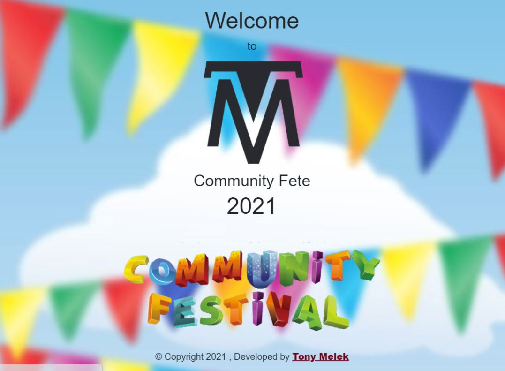
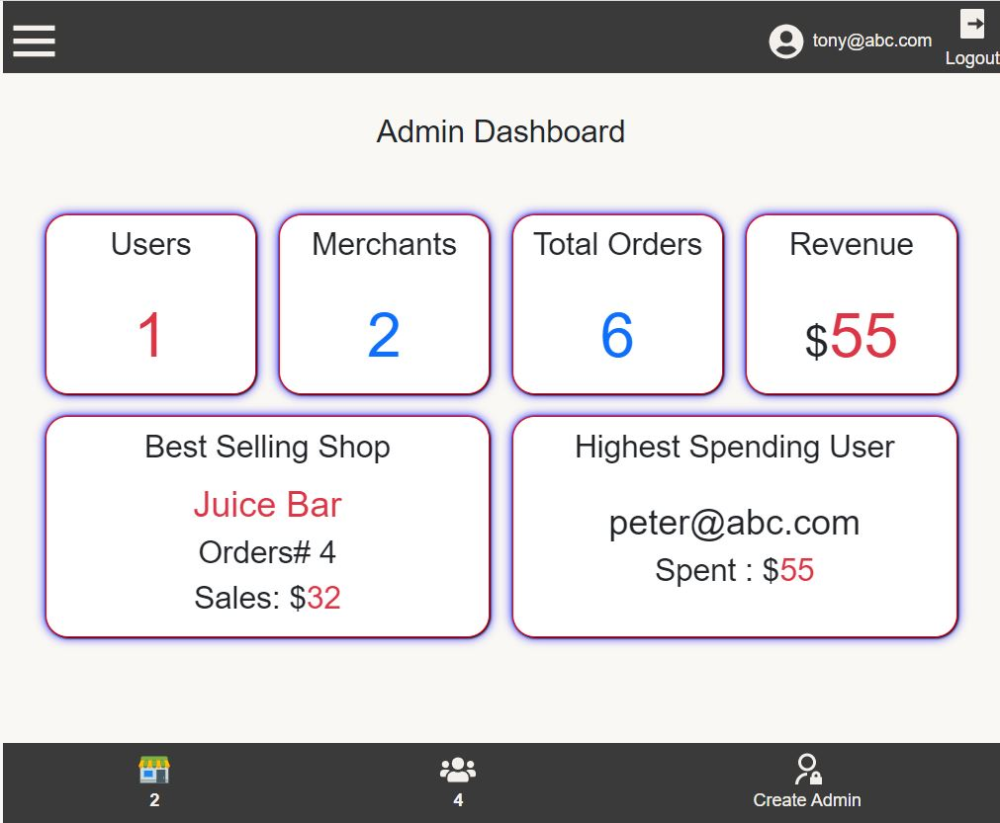
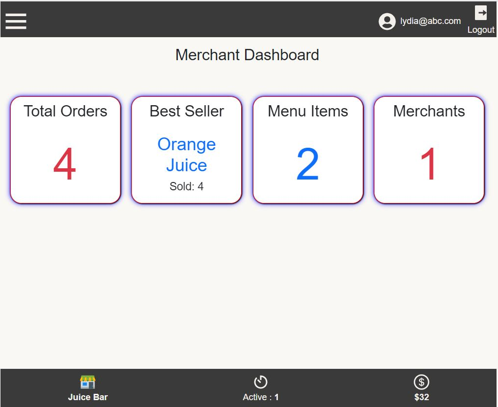
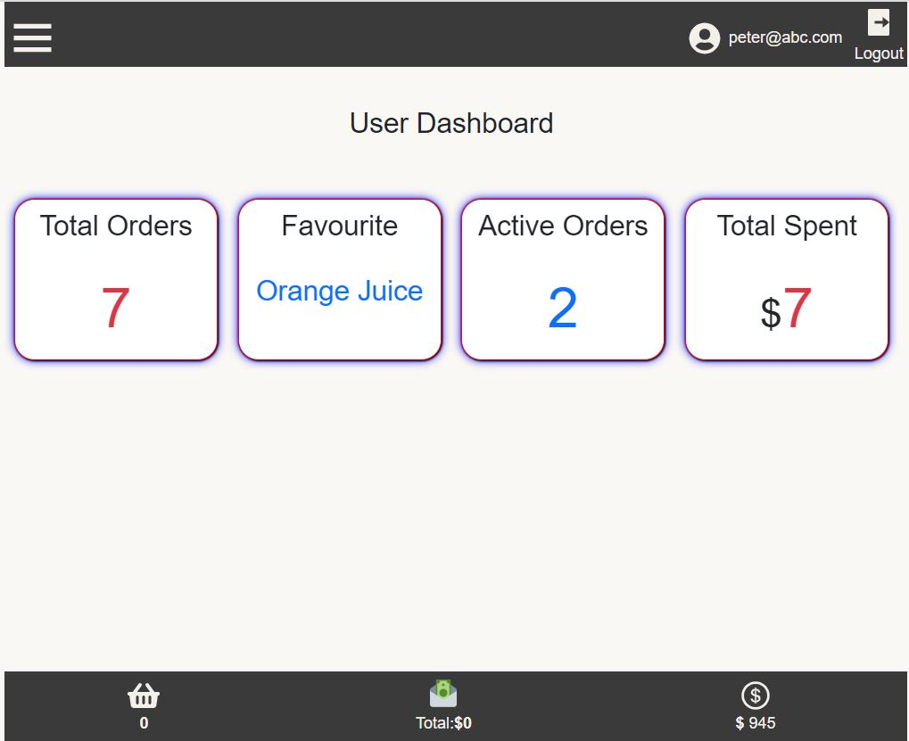
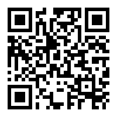

# Community Fete
* [Description](#description)
* [Installation](#installation)
* [Usage](#usage)
* [License](#license)
* [Contributing](#contributing)
* [Tests](#tests)
* [Questions](#questions)
## Description
Creating touchless buying and selling experience to clients and merchants at community fetes. Scan a QR code, then get access to all menus and activities and start ordering and live track order on app , only head to the shop to collect your order when it's ready.
## Installation
Install Node.js
Install MySQL work bench
Download or clone the repo from main branch
run `npm install` command in the terminal
create .env file and add the following variables 
 * DB_USER=*****
 * DB_PASS=*****
 * JWT_SECRET=*****
go to the terminal and run `npm start` command

## Usage
you will need to create the first admin
Use `postman` to make a Post request 
url : http://localhost:3000/api/create-first-admin
body :{
    "email":"****",
    "password":"****",
    "role":"admin"
}
Then go to the login/ signup page and start creating as many users as you like and try the interactions between users and merchants.
Admin account is used to create new shops, top-up users balances and assign merchants to the shops

## Contributing
Any new ideas recommendations or fixes are welcome, please send me an e-mail with your proposal, and once approved you will be added as contributor to the project
## Tests
You can try the deployed version of the app  [Community Fete](https://community-fete.herokuapp.com/) or use your mobile camera to scan the QR Code
 
## Questions
You are welcome to provide any feedback and/or ask questions.
Please, send any question to my e-mail [tonymelek.au@gmail.com](mailto:tonymelek.au@gmail.com) and/or visit my profile on [Github](https://github.com/tonymelek)

## License
The project is protected under MIT,you may need to read through license conditions